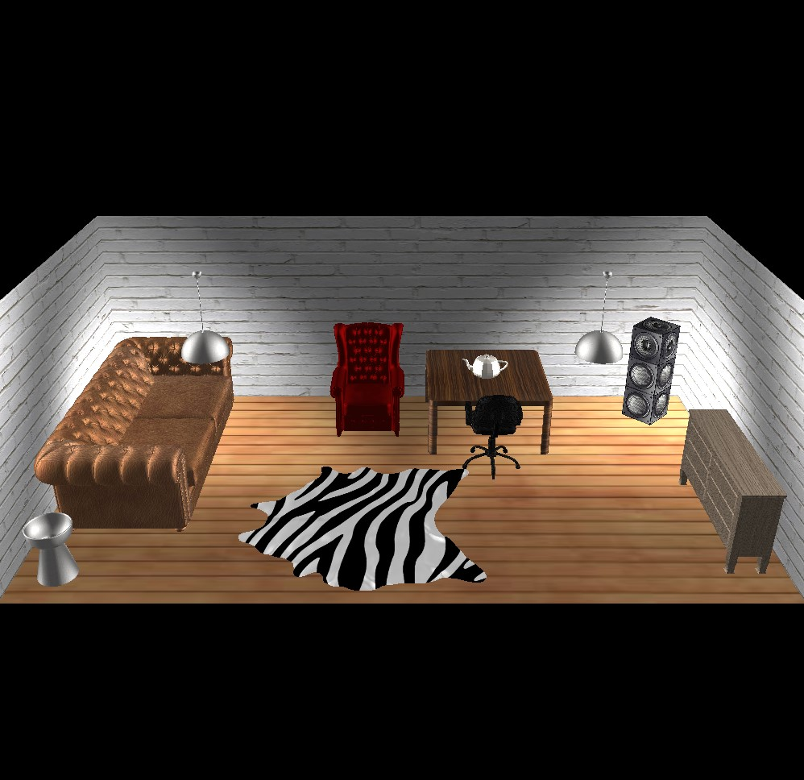

# 3D Room Designer
## Table of contents
* [General info](#general-info)
* [Technologies](#technologies)
* [Setup](#setup)
* [Screenshots](#screenshots)
* [Contributors](#contributors)

## General info
The program allows interior decorations - moving and rotating objects on the stage, changing the textures and sizes of walls and floor, as well as adding new models and textures using the assimp library. Commands should be executed in the console.
	
## Technologies
Project is created with:
* C++
* OpenGL
* [Assimp library](https://www.assimp.org)
	
## Setup
To run this project you should use Visual Studio 2019. Open the "pl_szkielet_03_win.sln" and then compile it (x86).

## Screenshots
Default preloaded scene

## Contributors
* ### [Andrzej Kapczyński](https://github.com/Endrju00)
* ### [Filip Kaczmarek](https://github.com/Filip-Kaczmarek)
